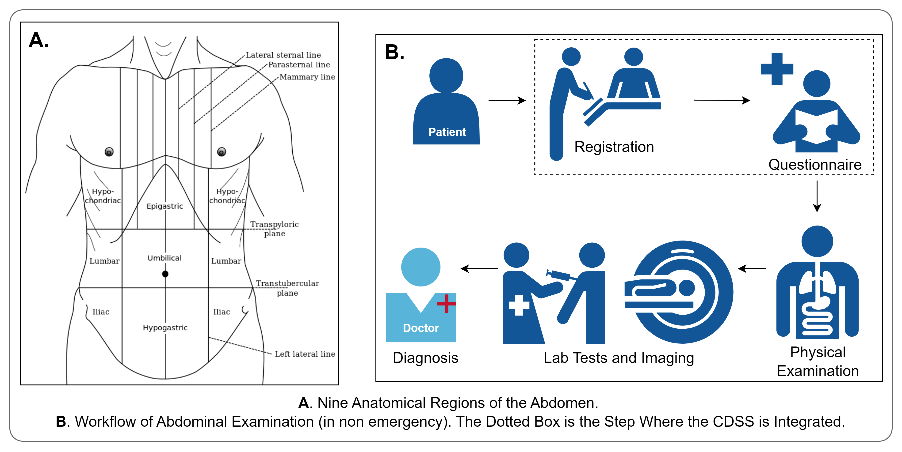
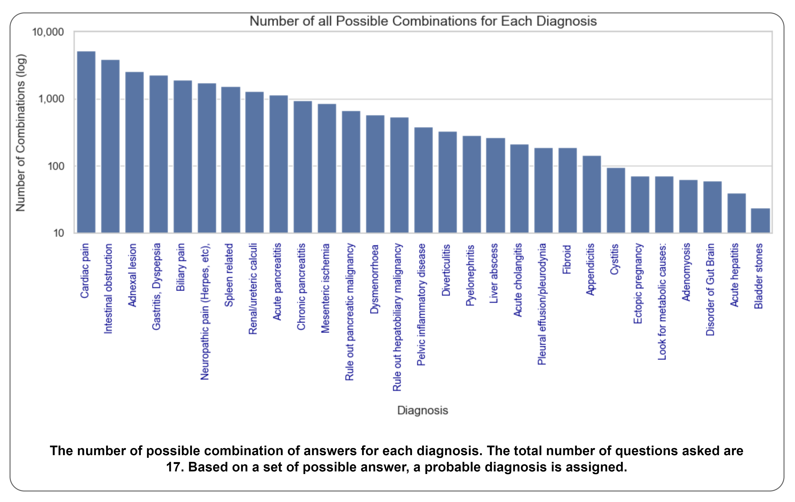
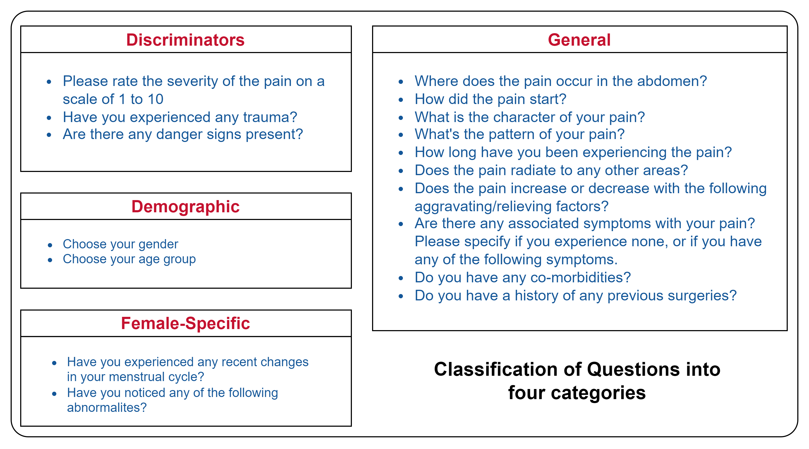
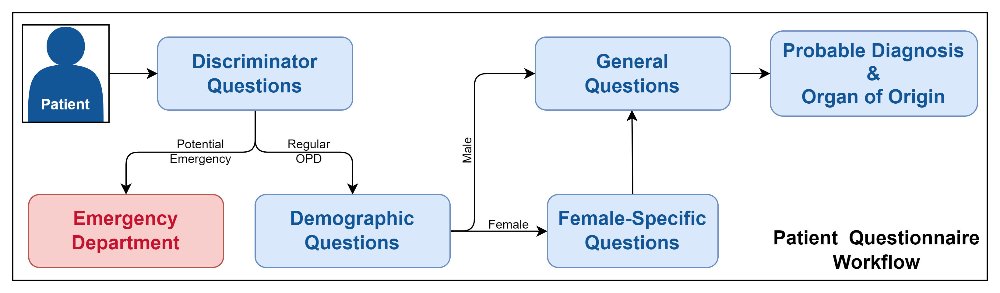
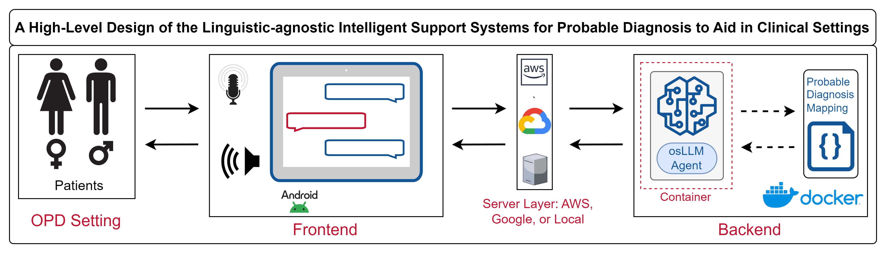
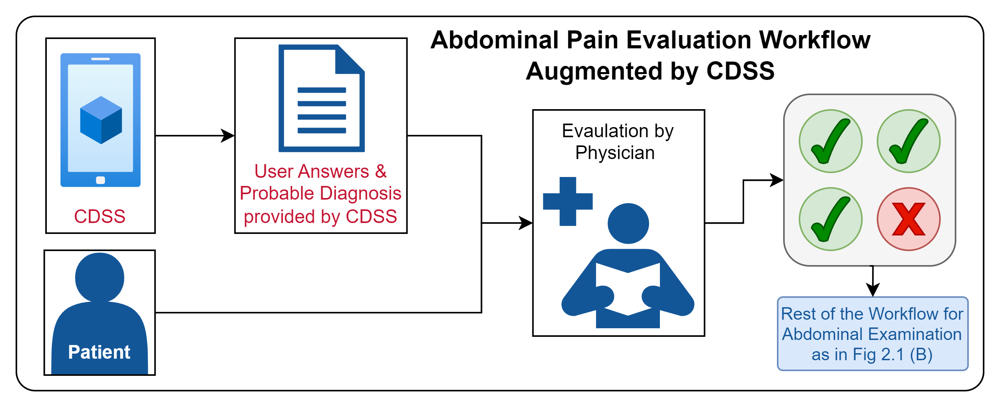

# Linguistic-agnostic Intelligent Support Systems for Probable Diagnosis to Aid in Clinical Settings

***#### Note: This project is still in development and is not yet available for public use. ###***

This project, in collaboration with the Department of Gastroenterology and Human Nutrition at the All India Institute of Medical Sciences (AIIMS), New Delhi, aims to develop a department-specific Clinical Decision Support System (CDSS) tailored to address the unique needs in the Outpatient Department (OPD) setting, specifically for abdominal pain. The system introduces an intelligent CDSS, where a linguistic-agnostic conversational agent engages directly with patients, collecting key responses and extracting information from a protocol-driven questionnaire. This information is then presented along with a probable diagnosis and organ of origin

## Supervisor
The project was guided and mentored by the following people:
- [Dr. Rintu Kutum](https://www.ashoka.edu.in/profile/rintu-kutum/), Faculty Fellow, Department of Computer Science, Ashoka University
- [Dr. Govind K Makharia](https://www.aiims.edu/index.php/en/component/content/article/96-gastroenterology-and-human-nutrition/5220-dr-govind-k-makharia_gastro), Professor, Department of Gastroenterology and Human Nutrition, All India Institute of Medical Sciences (AIIMS), New Delhi
- [Dr. Anurag Agrawal](https://www.ashoka.edu.in/profile/anurag-agrawal/), Dean, BioSciences and Health Research, Trivedi School of Biosciences, Ashoka University

## Table of Content
<!-- Table of Content -->
- [Linguistic-agnostic Intelligent Support Systems for Probable Diagnosis to Aid in Clinical Settings](#linguistic-agnostic-intelligent-support-systems-for-probable-diagnosis-to-aid-in-clinical-settings)
  - [Supervisor](#supervisor)
  - [Table of Content](#table-of-content)
  - [Background](#background)
  - [Motivation](#motivation)
  - [Objectives](#objectives)
  - [Project Plan](#project-plan)
  - [System Architecture](#system-architecture)
  - [Augmented Workflow](#augmented-workflow)
  - [Demo](#demo)
    - [Mobile Application](#mobile-application)
    - [Web Application](#web-application)
  - [Team](#team)
  

## Background
Abdominal pain is one of the most common and diagnostically challenging chief complaints encountered in clinical practice [[1]](https://karger.com/dsu/article/32/1/23/117534/Guideline-for-the-Diagnostic-Pathway-in-Patients). This wide range of potential causes increases diagnostic complexity, requiring a systematic and comprehensive evaluation process. 

  

## Motivation
ccording to the 2022-2023 Annual Report [[2]](https://www.aiims.edu/images/pdf/annual_reports/english1.pdf), the department managed a total of
1,35,944 outpatient department (OPD) cases, of which 42,586 were new cases
and 93,358 were follow-up cases. This is a significant increase from the previous year’s figures of 17,790 new cases and 35,622 follow-up cases as shown in Table 2.1 below. In total, the Main Hospital at AIIMS catered to 10,39,523 patients through its General OPD, Specialty Clinics, and Emergency Department.

The high influx of patients leaves little room for physicians to conduct comprehensive questionnaire-based evaluations before physical examinations.

This challenge forms the motivation for the development of a Clinical Decision Support System (CDSS). The CDSS aims to streamline the process of collecting responses to structured questionnaires and assist physicians in formulating probable diagnoses and identifying the organ of origin before physical examination.

As depicted in the bar chart below, for a set of 29 probable diagnoses, the top diagnosis can have upwards of 5,000 possible combinations of answers to the questionnaire.

  

## Objectives
The primary objectives of this project are as follows:
- **Development of a Department-Specific CDSS**: To design and develop a department specific, intelligent clinical decision support system for the screening of abdominal pain. This system will identify the probable diagnosis and organ of origin based on a structured, protocol-driven questionnaire to aid physicians.
- **Design of a Linguistic-Agnostic Conversational Agent**: To design and develop a conversational agent that is linguistic-agnostic to drive above mentioned CDSS.
- **Deployment and Integration**: To deploy and integrate the system in the OPD setting at the Department of Gastroenterology and Human Nutrition, AIIMS, New Delhi

The project also has a set of secondary objectives, which are as follows:
- **Collection of Linguistic Data**: To collect linguistic data from patients at AIIMS, representing diverse accents, dialects, and language variations. This data will be used to improve the robustness of linguistic-agnostic models for future use.
- **Evaluation of a Rule-Based and Generative Hybrid System**: To develop and evaluate a hybrid approach that combines a rule-based, deterministic decision making engine with a generative AI conversational agent for more robust and explainable clinical support.

## Project Plan
The 17 questions are divied into four categories: 
- **Discriminators**: To differentiate between emergency cases and regular OPD cases.
- **Demographic**
- **Female-Specific**: Questions specific to female health issues — menstrual health.
- **General**: These are common questions.

  

Figure below shows the graphical representation of the mapping between questions, diagnoses (pink, center), and organs of origin (orange, center below).

  

The workflow of the system is as follows:

  

## System Architecture
The system architecture is as follows:

  

## Augmented Workflow
The augmented workflow with the CDSS is as follows:

  

## Demo
We have developed a prototype of the system. The prototype is created for mobile devices as well as a web application. The video below shows the demo of the system.

### Mobile Application

    <video src="./demo/mobile-demo.mp4" width="300" height="600" controls preload></video>

### Web Application
The web application for a successful diagnosis is shown below:

    <video src="./demo/webapp-demo-diagnosis.mp4" width="600" height="300" controls preload></video>

The web application for a emergency case is shown below:

    <video src="./demo/webapp-demo-emergency-visit.mp4" width="600" height="300" controls preload></video>

## Team
This project is a part of Bachelor's Capstone Project, Department of Computer Science, Ashoka University. The team members are:
- [Gautam Ahuja](https://www.linkedin.com/in/gautam8387/)

